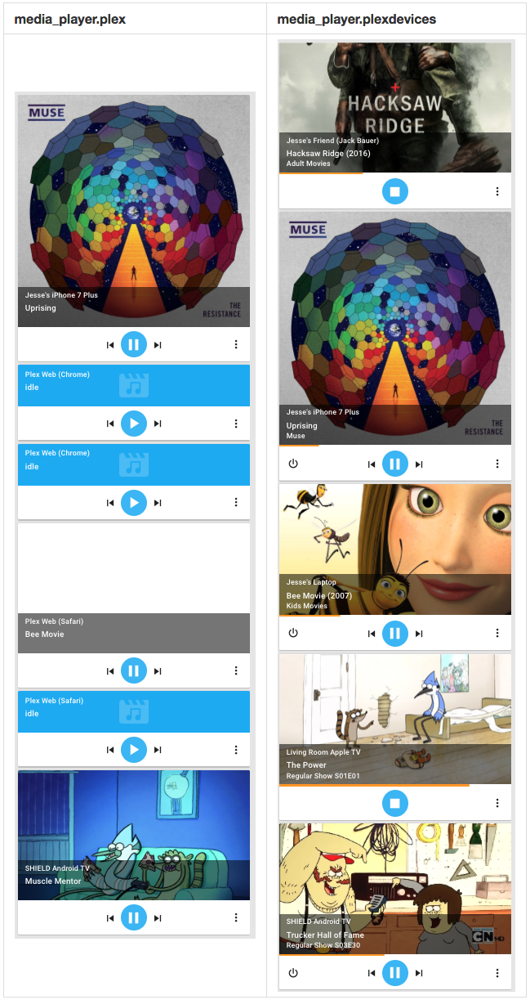

# PLEXDEVICES
Displays and controls active and previously connected Plex streamers and clients

<!-- TOC depthFrom:2 depthTo:6 withLinks:1 updateOnSave:1 orderedList:0 -->

- [Alternatives](#alternatives)
	- [Why not media_player.plex](#why-not-mediaplayerplex)
		- [Side by Side Comparison](#side-by-side-comparison)
	- [Why not Plex WebHooks](#why-not-plex-webhooks)
- [Features](#features)
- [Installation](#installation)
- [Compatibility](#compatibility)
- [Known Issues](#known-issues)
- [Usage](#usage)
	- [Dynamic Grouping](#dynamic-grouping)
		- [Examples](#examples)
	- [PlayMedia](#playmedia)
		- [Music](#music)
		- [Playlists](#playlists)
		- [Episodes](#episodes)
		- [Video](#video)

<!-- /TOC -->

> *DISCLAIMER:* This is code I hacked through for my home automation (I am an advanced Home Assistant user, not a Home Assistant developer).  It is minimally tested and comes with no support or guarantees.  Use at your own risk.

## Alternatives

### Why not media_player.plex
A plex streamer is any device that streams from your plex server.  A plex client is a streamer but can also be remotely controlled.  The existing media_player.plex component only shows clients so you are missing out on things like remote users and PlexConnected Apple TV's (how gen 2 and 3 Apple TV's connect to Plex).

media_player.plex is also missing a bunch of meta data, doesn't let you control things like volume, and more.  There's also a ton of additional features only available in this PlexDevices component.

#### Side by Side Comparison
Click on image for full screen view


### Why not Plex WebHooks
Web hooks are good for simple action / reaction (media plays, turn on lights). I use something similar for my Blue Iris setup. If that's all you need, then use the web hooks.  This component not only allows you to do the same but it also:
1. Provides you with a visual map of what's occurring on your plex server (looks cool too)
2. Allows you to manually respond to events
3. Allows you to manually control players (i.e. a single page to remote control every client connected to your plex server)
4. Easier setup and maintenance (nothing to configure on your plex server, nothing new to learn/manage)
5. Doesn't require a plex pass subscription
6. Extensible - We can add functionality as needed

## Features
(compared to media_player.plex)
* Misc
  * Remote users - see what remote users are streaming
  * PlexConnect gen 2/3 Apple TV's - see whats streaming on your PlexConnect Apple TV devices
  * Dynamic grouping - Automatically groups devices into "active" and "inactive" groups enabling you to:
    * avoid manually maintaining group memberships because you just want to see who's connected / streaming
    * show all active devices in an ha view (like the now playing view within plex)
    * create a "plex activity monitor" like sensor just by displaying the "active" group count
    * show the "inactive" group as running history of previous connections
    * set automations like:
      * alert me when connected count is high, alert me when a new device connects (i.e. active group size increased)
      * alert on or disconnect an unknown device (i.e. device in "connected" group is not in some other list or group you maintain)
      * stop any device streaming for more than a day
    * Too many more to list
  * Always art - display media art if thumbnail not available (good for items in Plex with no poster)
* Automations
  * A bunch of new attribute values to use in your automations:
    * ex. Raise the lights when volume low or muted:
      * Use volume_level and is_muted
    * ex. Alert when a remote user is streaming
      * Use friendly_name or entity name
    * ex. Alert when your child plays a video from the "Adult Movies" library)
      * Use friendly_name and app_name (Plex Library Name)
    * ex. Alert when your child plays a song from the "Adult Music" library)
      * Use friendly_name and app_name (Plex Library Name)
    * ex. Turn off the lights when playing a video from video libraries but never from music libraries
      * Use friendly_name and app_name (Plex Library Name)
    * ex. Alert you when you won't have time to finish watching a movie
      * Use media_duration (length of movie) and media_position (where you are in the movie) to calculate when the movie will finish / compare that to your calendar appointments, kid's bedtime, etc
    * Too many more to list
* Controls
  * On/Off: On does nothing but Off stops playing media (good to kick of unwanted users / kids past their bedtime)
  * Volume/Mute: Can set and mute (Plex client syncs with what HA tells it, not the other way around)
  * Progress: Display a media progress bar
  * PlayMedia: Make a plex client play a movie, tv show, or music playlist
* Movies
  * Display name as "Name (Year)", ex. Blair Witch (2016)
  * Display library name below movie title (ex. "Adult Movies")
* TV
  * Display episode and season numbers with leading 0's, ex 02, 05
  * Display "Show S##E##", ex. Rick and Morty S02E05
  * Display episode thumbnail instead of show thumbnail
* Music:
  * Display Artist (track artist, if not use album artist)
  * Set albumn name property

## Installation
1. Copy to your ha\custom_components\media_player directory
  * You may need to "chmod 777 plexdevices.py" on linux systems
2. Add it to your config:
```
    media_player:
			- platform: plex
		    include_non_clients: true
		    use_episode_art: true
		    use_dynamic_groups: true
```
Note: include_non_clients, use_episode_art, and use_dynamic_groups are optional and default to false
3. Create the same ha\plex.conf file media_player.plex uses or ha should display a configurator to create it for you

## Compatibility
Here's what I've tested it with so far:
* NVidia Shield
* PlexConnected Apple TV 3
* Plex Web Safari
* Plex Web Chrome
* Tivo Plex App
* iPhone Plex App

## Known Issues
* Dynamic groups aren't fully being recognized so until I get a dev to debug this issue you won't be able to do things like this:
  * {{ states.group._plex_devices_connected.attributes.entity_id | length }}
* PlexConnect Apple TV's (issues occur in HA and the Plex Now Playing web page)
  * No working controls (since they aren't full clients)
  * Playing music is not visible (likely because it plays as background music)
  * Playing a season only shows first episode
* NVidia Shield freezes with PlayMedia Music or Playlist (might just be my Shield)

## Usage

### Dynamic Grouping
This component will automatically create and maintain the following groups:
* group._plex_devices_active - Device that are currently playing or paused on Plex media
* group._plex_devices_inactive - Device that are idle or in an unknown state

#### Examples
Example: Display an "All Plex Devices" view
```
group:
  all_plex_view:
    name: All Plex Devices
    view: yes
    entities:
    - group._plex_devices_active
    - group._plex_devices_inactive
```

Example: Display "Active Plex Devices" and "Inactive Plex Devices" views
```
group:
  active_plex_view:
    name: Active
    view: yes
    entities:
    - group._plex_devices_active

  inactive_plex_view:
    name: Inactive
    view: yes
    entities:
    - group._plex_devices_inactive
```

### PlayMedia
You can test the PlayMedia service using the HA GUI (Services | Media_Player | PlayMedia)

#### Music
```
{
    "entity_id" : "media_player.plex_bb72ed6a42aa26ea_com_plexapp_android",
    "media_content_id": "{ \"library_name\" : \"Jesse Music\", \"artist_name\" : \"Adele\", \"album_name\" : \"25\", \"track_name\" : \"hello\", \"shuffle\": \"0\" }",
    "media_content_type": "MUSIC"
}
```

#### Playlists
```
{
    "entity_id" : "media_player.plex_bb72ed6a42aa26ea_com_plexapp_android",
    "media_content_id": "{\"playlist_name\" : \"The Best of Disco\", \"shuffle\": \"0\" }",
    "media_content_type": "PLAYLIST"
}
```

#### Episodes
```
{
    "entity_id" : "media_player.plex_bb72ed6a42aa26ea_com_plexapp_android",
    "media_content_id": "{ \"library_name\" : \"Adult TV\", \"show_name\" : \"Rick and Morty\", \"episode_number\" : 15, \"shuffle\": \"0\" }",
    "media_content_type": "EPISODE"
}
```
#### Video
```
{
    "entity_id" : "media_player.plex_bb72ed6a42aa26ea_com_plexapp_android",
    "media_content_id": "{ \"library_name\" : \"Adult Movies\", \"video_name\" : \"Blade\", \"shuffle\": \"0\" }",
    "media_content_type": "VIDEO"
}
```
